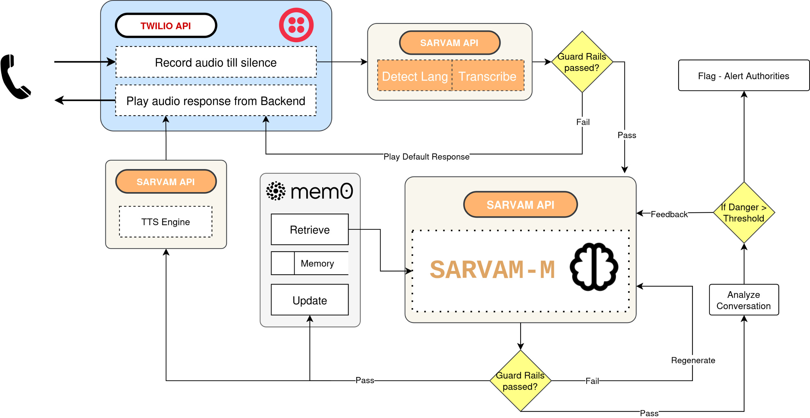

# 🏥 Intellicare: Voice-first Mental Health Hotline Agent

## Overview

**Intellicare** is a multilingual, voice-based AI assistant engineered specifically for sensitive mental health-related conversations. Unlike text-based agents, Intellicare leverages real-time voice interaction and contextual memory to provide a more human-like, empathetic experience. Designed for high-stakes applications such as suicide hotlines and mental health support, Intellicare combines speech recognition, memory-augmented conversations, advanced safety guardrails, and real-time inference pipelines with sub-10 second latency. It can be directly accessed by calling a phone number.

Refer to the system diagram for a full overview of the data flow and system architecture.

---


## 🌐 Key Features

* **Voice-first interface** with real-time phone integration
* **Multilingual understanding** via language detection
* **Personalized memory** through semantic memory retrieval
* **Guardrailed LLM** using GuardRails and GemmaShield 2B
* **Real-time self-harm detection and risk assessment** using sentence-transformer models

---

## 🔗 System Pipeline (Refer to the Diagram)

### 1. 📞 Call Handling (Twilio API)

* The user speaks into a phone, and Twilio records the **audio until silence**.
* After processing, it **plays the backend's audio response** back to the user.

### 2. 🌍 Transcription and Language Detection (Sarvam API)

* The audio is sent to **Sarvam's ASR** and **Language ID** modules.
* The system first detects the language, then transcribes the speech accordingly (ASR handles both detection and transcription)

### 3. ⚠️ Guardrails on User Input

* The transcribed input is passed through **GemmaShield 2B (GuardRails)** to assess safety, mainly on HATE SPEECH and HARASSMENT.
* If **guardrails fails**, a **default fallback response** is played immediately via Sarvam TTS.
* If passed, the input continues to the LLM.

### 4. 🔖 Memory Retrieval (Mem0)

* The memory module **retrieves contextual embeddings** relevant to the user’s input, to further enhance the personalization, especially in long phone conversations.
* These are fed into the **SARVAM-M** LLM for context-aware, multi-lingual generation, supporting most major Indian languages.

### 5. 🧠 LLM Response Generation (SARVAM-M)

* **SARVAM-M**, the multi-lingual LLM, generates the response, prompted specifically to be emphathetic, non judgemental and an active listerner.
* The output is again passed through **GuardRails** to ensure safety, this time to assess HARMFULNESS of the content, we understand how important this is when it comes to crisis situations like suicide, where every word matters.

  * On **fail**, the model is prompted to **regenerate** its response to align better with the safety guidelines. Upon repeated failure, we disconnect the call for user's safety and nudge them to seek other resources.

### 6. ⚠️ Risk Detection & Flagging

* Simultaneously, the conversation is analyzed by a **sentence-transformer-based classifier**.
* If the **danger score > threshold**, the system **flags authorities or relevant parties** (right now a place holder flag)

### 7. 🎧 Text-to-Speech Playback

* Once the response passes safety checks, it is **converted to audio** using Sarvam TTS.
* The response is sent back via Twilio to the user.
* Memory is **updated** with the latest conversation turn.

---
## Project Structure

```
IntelliCare/
├──                           # Main app for call and memory management
│   ├── models.py                   # Database models (Call, Memory, CallNote, EmergencyContact)
│   ├── admin.py                    # Admin interface configuration
│   ├── views.py                    # API views and Twilio webhooks
│   ├── serializers.py              # Django REST Framework serializers
│   ├── urls.py                     # URL routing
│   └── management/commands/        # Management commands
│       └── create_sample_data.py   # Create sample data for testing
├── hotline_backend/                # Django project settings
│   ├── settings.py                 # Main settings
│   └── urls.py                     # Main URL configuration
├── requirements.txt                # Python dependencies
├── .env                            # Environment variables
└── manage.py                       # Django management script
```


---
## ⚙️ Technologies Used

### Core APIs:

* **Sarvam AI**

  * ASR (Speech to Text)
  * TTS (Text to Speech)
  * Language ID
  * SARVAM-M (LLM engine)

* **Twilio API**

  * Phone call initiation
  * Audio recording/playback

* **Mem0**

  * Semantic memory storage and retrieval

* **GuardRails + GemmaShield 2B**

  * Safety filtering on user and model sides

* **SentenceTransformers (SetFit)**

  * Semantic similarity for memory
  * Danger classification for flagging

---

## 🚀 Why Intellicare?

* Traditional chatbots feel robotic and impersonal, especially in mental health scenarios.
* Text-based input can be a barrier for users in distress.
* Intellicare leverages **natural voice**, **contextual understanding**, and **empathy-aware modeling** to create a truly supportive assistant.
---

## Limitations
* Latency. Although we achieve good latency for the amount of processesing we run on speech and language, latency needs to be reduced to achieve a human-like performance.
* Voice Modulation. The APIs we have used currently are well suited for TTS tasks but do not focus too much on real human-like voice modulations while speaking.

